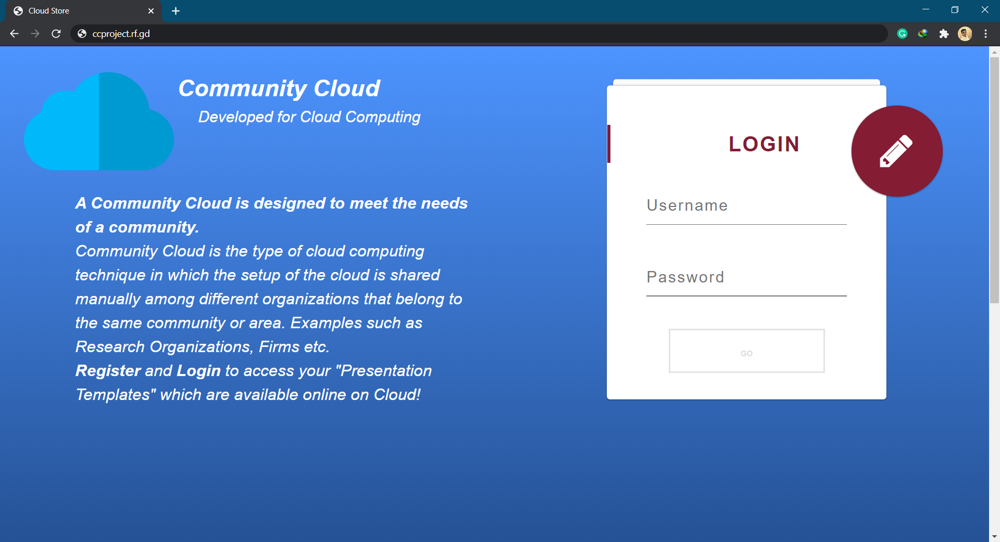
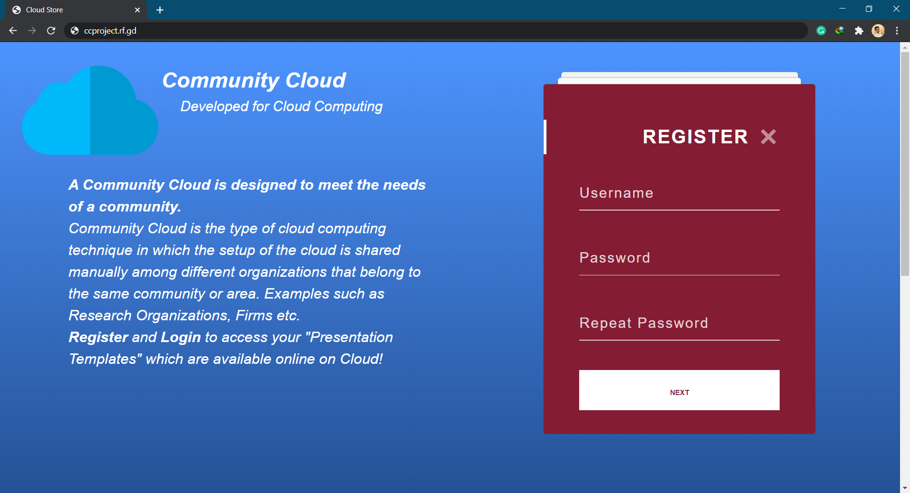
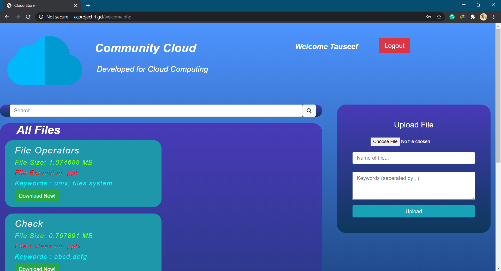

# Cloud-Computing-Project
> Community Cloud in Cloud Computing Project 

## Introduction
A Community Cloud is designed to meet the needs of a community.
Community Cloud is the type of cloud computing technique in which the setup of the cloud is shared manually among different organizations that belong to the same community or area. Examples such as Research Organizations, Firms etc.
Register and Login to access your "Presentation Templates" which are available online on Cloud!

## Snapshot of the project

## Hosted Website
Visit [Cloud PPT Storage Project](http://ccproject.rf.gd/) to access PPT files on the go
